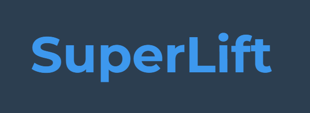
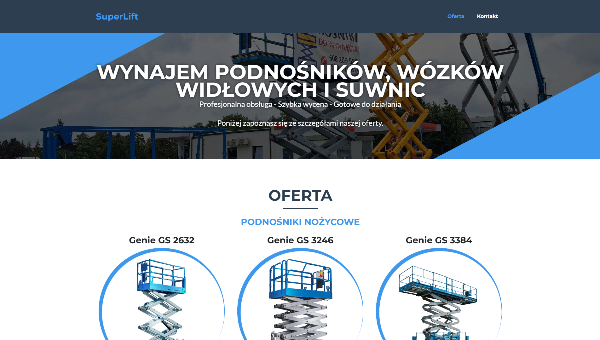
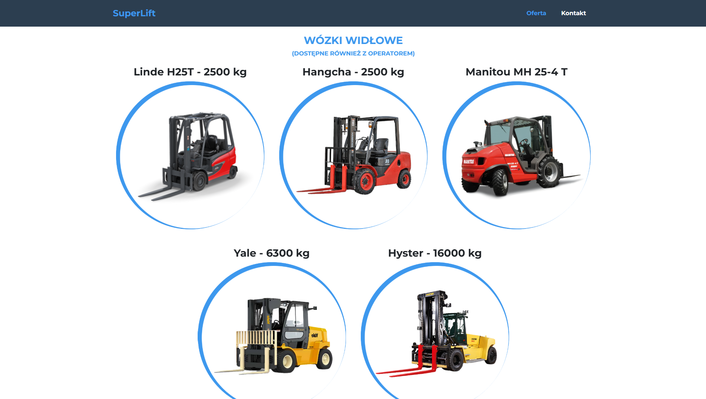
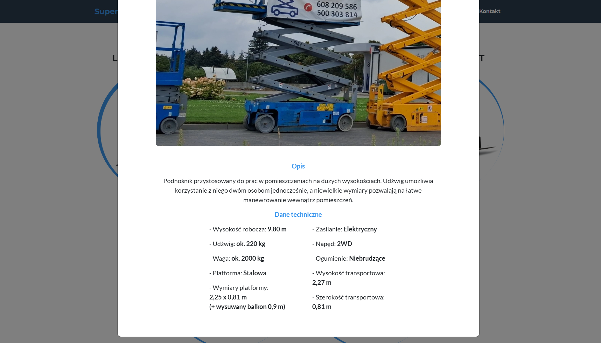
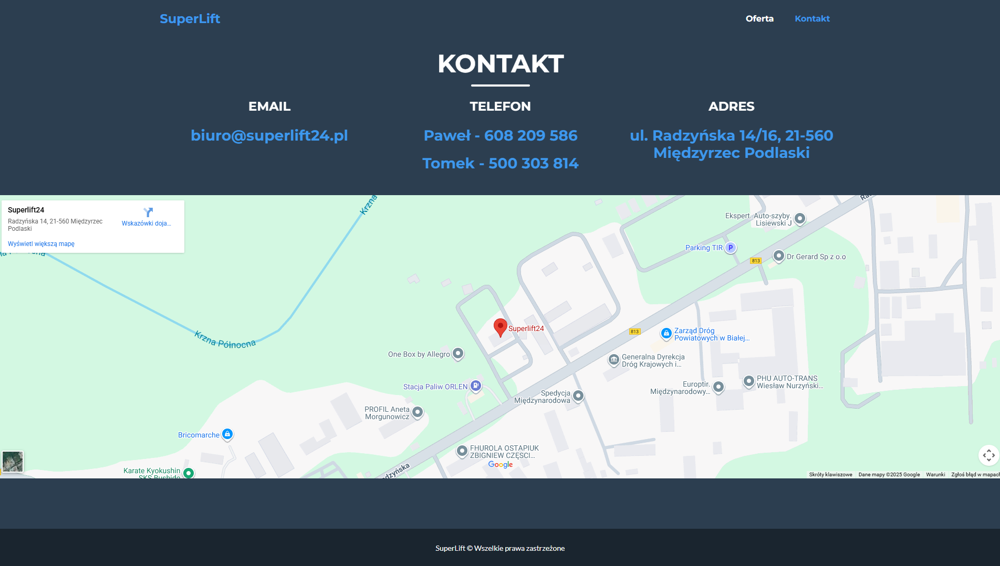
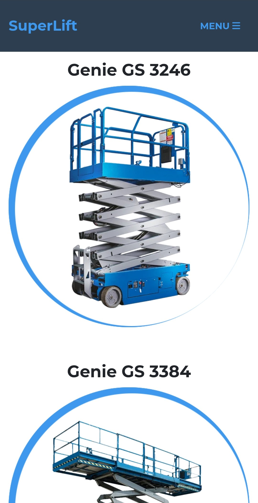
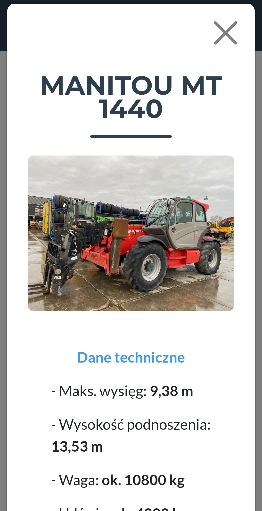

# SuperLift - One-Page Website

  

## Table of Contents
- 🚀 [Project Overview](#project-overview)
- ✨ [Features](#features)
- 💻 [Technologies](#technologies)
- 📋 [Requirements](#requirements)
- 🛠️ [Setup Instructions](#setup-instructions)
- 📸 [Screenshots](#screenshots)

## Project Overview

**SuperLift** is a one-page site showcasing the offerings of a company that rents lifts, forklifts and cranes.
> [!NOTE]  
> The website is only available in Polish language version!

## Features

- 🏗️ Modals displaying technical data of machines available in the offer
- 📱 Full responsiveness

## Technologies

**Frontend:**
- Bootstrap
- HTML
- JavaScript

## Requirements
Software versions used for development:
- Bootstrap 5.0
> [!WARNING]  
> Compatibility with earlier versions has not been tested.

## Setup Instructions

Just go to www.superlift24.pl.

OR

1. Download this repository.
2. Open the index.html file.

## Screenshots

  
  
  
  

### Mobile Device

 
